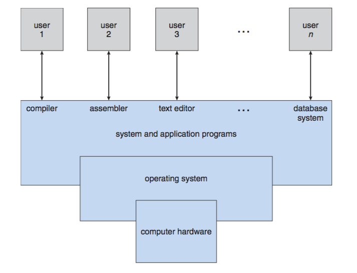

# Lecutre 1: Course Overview

## [Syllabus](https://www.google.com)
## Topics to be covered
### Overview (Ch 1-2)
1. Fetures of OS
2. Tasks of OS
### Process Management (Ch 3-6)
A process is
1. the heart of OS,
2. the unit of work in OS.
Types of process:
1. OS processes,
2. user processes.
Topics to be covered:
1. process scheduling, 
2. interprocess communication, 
3. process synchronization,
4. deadlock handling,
5. threads
6. issues related to multicore systems and parallel programming.
### Memory management (Ch 7-8)
Task: the management of main memory during the execution of a process
Goal: to improve both the utilization of the CPU and the speed of its response to its users
Topics: different memory-management schemes
### Storage management (Ch 9-12)
Topics:
1. mass storage
2. file system
3. I/O
### Protection and security (Ch 13-14)
Protection is a mechanism for **controlling** the access of programs, processes, or users to computer-system resources.

## Programming
[Linux virtual machine](http://people.westminstercollege.edu/faculty/ggagne/osc/vm/index.html)

## Part 1: Overview/Chapter 1: Introduction
1. OS is an intermediary between users and computer hardwares.
2. OS is software.
3. The goal of OS should be well-defined before the design begins (OS vary in diffrent tasks).
### Computer system

#### 1. hardwares
1). CPU/Central Processing Unit

2). Memory

3). I/O devices (monitor,mouse,keyborad,printer,touch screen,etc)

#### 2. OS
1). Windows
2). MAC OS
3). Linux
4). Android
5). iOS
6). for IoT(Internet of Things)
Fuchsia OS
Homany OS
#### 3. application programs

#### 4. users

### Two different views to understand the role of OS
#### 1. User view
ease of use
#### 2. System view

resouce allocator

1). CPU time 
2). memory space
3). file storage space
4). I/O devices

