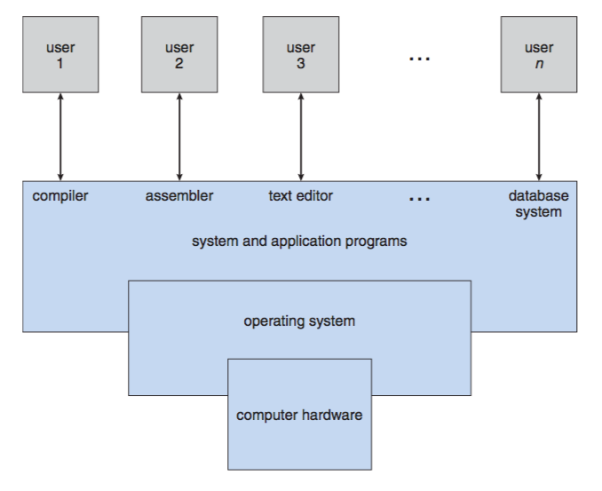
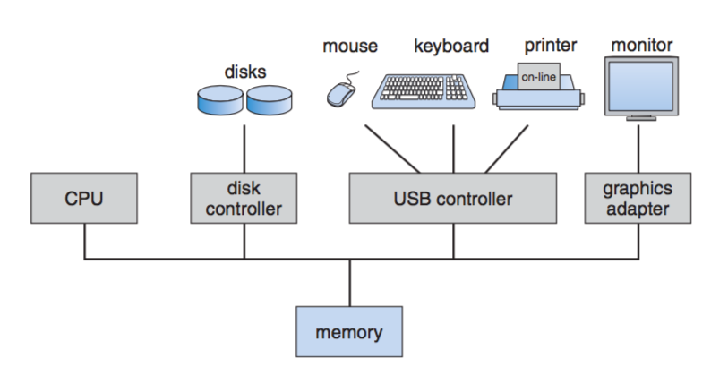

# CSCI 410 Operating Systems
# Fall 2019
# Chapter 1: Introduction

# Topics
+ What Operating Systems Do
+ Computer-System Organization
+ Computer-System Architecture
+ Operating-System Structure
+ Operating-System Operations
+ Process Management
+ Memory Management
+ Storage Management
+ Protection and Security
+ Distributed Systems
+ Special-Purpose Systems
+ Computing Environments
+ Open-Source Operating Systems
# Objectives
+ To provide a grand tour of the major operating systems components
  - Chapter 1 is broad coverage but shallow
+ To provide coverage of basic computer system organization

# What is an Operating System?
+ A program that acts as an intermediary between a user of a computer and the computer hardware

+ Operating system goals:
  - Execute user programs (Safely!)
  - Make the computer system convenient to use
  - Use the computer hardware in an efficient manner

# Computer System Structure
Computer system can be divided into four components:
+ Hardware – provides basic computing resources
  - CPU, memory, I/O devices
+ Operating system
  - Controls and coordinates use of hardware among various applications and users
+ Application programs – Software to solve computing problems of users
  - Word processors, compilers, web browsers, database systems, video games
+ Users
  - People, machines, other computers

# What Operating Systems Do
+ Depends on point of view
+ Users want convenience, ease of use
  - Don’t care about resource utilization
+ Shared computers such as mainframe or minicomputer must keep all users happy
+ Users of dedicate systems such as workstations have dedicated resources
  - Still share among processes
+ Handheld computers are resource poor,  optimized for usability and battery life
+ Some computers have little or no user interface, such as embedded computers in devices and automobiles

# Operating System Definition
+ No universally accepted definition
+ OS is a resource allocator
  - Manages all resources
  - Decides between conflicting requests for efficient and fair resource use

+ OS is a control program
  - Controls execution of programs to prevent errors and improper use of the computer

+ “Everything a vendor ships when you order an operating system” is good approximation
  - But varies wildly

+ “The one program running at all times on the computer” is the kernel.  Everything else is either a system program (ships with the operating system) or an application program.

# Computer Startup
+ bootstrap program is loaded at power-up or reboot
  - Typically stored in ROM or EPROM, generally known as firmware
  - Initializes all aspects of system
  - Loads operating system kernel and starts execution
# Computer System Organization
## Computer-system operation
+ One or more CPUs, device controllers connect through common bus providing access to shared memory
+ Concurrent execution of CPUs and devices competing for memory cycles

