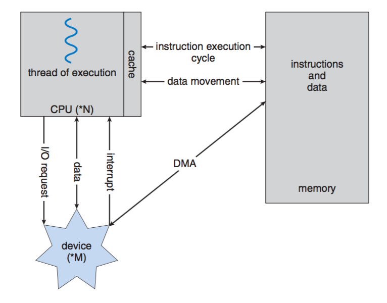
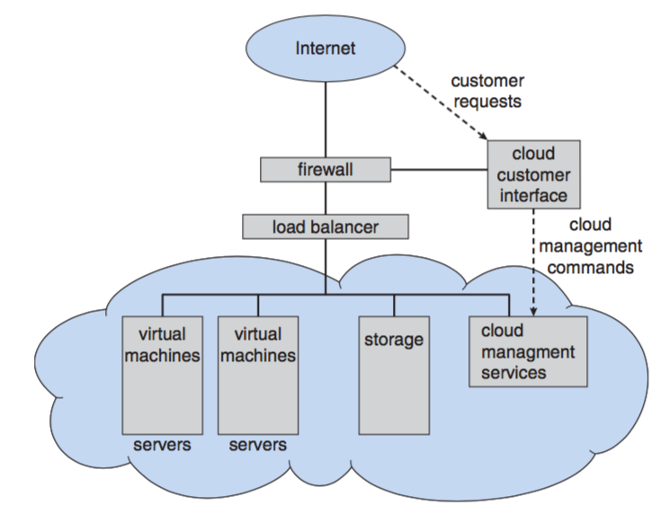

# CSCI 410 Operating Systems
# Fall 2019
# Chapter 1: Introduction

# Topics
+ What Operating Systems Do
+ Computer-System Organization
+ Computer-System Architecture
+ Operating-System Structure
+ Operating-System Operations
+ Process Management
+ Memory Management
+ Storage Management
+ Protection and Security
+ Distributed Systems
+ Special-Purpose Systems
+ Computing Environments
+ Open-Source Operating Systems
# Objectives
+ To provide a grand tour of the major operating systems components
  - Chapter 1 is broad coverage but shallow
+ To provide coverage of basic computer system organization

# What is an Operating System?
+ A program that acts as an intermediary between a user of a computer and the computer hardware

+ Operating system goals:
  - Execute user programs (Safely!)
  - Make the computer system convenient to use
  - Use the computer hardware in an efficient manner

# Computer System Structure
Computer system can be divided into four components:
+ Hardware – provides basic computing resources
  - CPU, memory, I/O devices
+ Operating system
  - Controls and coordinates use of hardware among various applications and users
+ Application programs – Software to solve computing problems of users
  - Word processors, compilers, web browsers, database systems, video games
+ Users
  - People, machines, other computers

# What Operating Systems Do
+ Depends on point of view
+ Users want convenience, ease of use
  - Don’t care about resource utilization
+ Shared computers such as mainframe or minicomputer must keep all users happy
+ Users of dedicate systems such as workstations have dedicated resources
  - Still share among processes
+ Handheld computers are resource poor,  optimized for usability and battery life
+ Some computers have little or no user interface, such as embedded computers in devices and automobiles

# Operating System Definition
+ No universally accepted definition
+ OS is a resource allocator
  - Manages all resources
  - Decides between conflicting requests for efficient and fair resource use

+ OS is a control program
  - Controls execution of programs to prevent errors and improper use of the computer

+ “Everything a vendor ships when you order an operating system” is good approximation
  - But varies wildly

+ “The one program running at all times on the computer” is the kernel.  Everything else is either a system program (ships with the operating system) or an application program.

# Computer Startup
+ bootstrap program is loaded at power-up or reboot
  - Typically stored in ROM or EPROM, generally known as firmware
  
  
  
  - Initializes all aspects of system
  - Loads operating system kernel and starts execution
# Computer System Organization
## Computer-system operation
+ One or more CPUs, device controllers connect through common bus providing access to shared memory
+ Concurrent execution of CPUs and devices competing for memory cycles

+ I/O devices and the CPU can execute concurrently

+ Each device controller is in charge of a particular device type

+ Each device controller has a local buffer (RAM)

+ CPU moves data from/to main memory to/from local buffers

+ I/O is from the device to local buffer of a controller

+ Device controller informs CPU that it has finished its operation by causing an **interrupt**

### Common Functions of Interrupts
+ Interrupt transfers control to the interrupt service routine generally, through the interrupt vector, which contains the addresses of all the service routines

+ Interrupt architecture must save the address of the interrupted instruction

+ Incoming interrupts are disabled while another interrupt is being processed to prevent a lost interrupt

+ A **trap** is a software-generated interrupt caused either by an error or a user request

+ An operating system is interrupt driven

### Interrupt Handling
+ The operating system preserves the state of the CPU by storing registers and the program counter

+ Determines which type of interrupt has occurred:
  - polling
  - vectored interrupt system

+ Separate segments of code determine what action should be taken for each type of interrupt

### Interrupt Timeline

# I/O Structure Types
+ After I/O starts, control returns to user program only upon I/O completion
  - Wait instruction idles the CPU until the next interrupt
  - Wait loop (contention for memory access)
  - At most one I/O request is outstanding at a time, no simultaneous I/O processing

+ After I/O starts, control returns to user program without waiting for I/O completion
  - System call – request to the operating system to allow user to wait for I/O completion
  - Device-status table contains entry for each I/O device indicating its type, address, and state
  - Operating system indexes into I/O device table to determine device status and to modify table entry to include interrupt
## Direct Memory Access Structure
+ Used for high-speed I/O devices able to transmit information at close to memory speeds

+ Device controller transfers blocks of data from buffer storage directly to main memory without CPU intervention

+ Only one interrupt is generated per block, rather than the one interrupt per byte

# Storage Structure
## Notation Review
+ Computer storage, along with most computer throughput, is generally measured and manipulated in bytes and collections of bytes.
  - bit is a 0/1; byte is 8 bits (nibble is 4 bits!)
  - Word depends on CPU register size (native data unit size: 16 bit, 32 bit, 64, bit)
  - kilobyte, or KB, is 1,024 bytes
  - megabyte, or MB, is 1,0242 bytes
  - gigabyte, or GB, is 1,0243 bytes
  - terabyte, or TB, is 1,0244 bytes 
  - petabyte, or PB, is 1,0245 bytes
  - exabyte, EB, is 1,0246 bytes (zeta, yota, xenotta, Shilentno, domegemegrotte) (Internet traffic will reach 1.3 ZB in 2016)
+ NOTE: Network throughput is usually measured in powers of 10.
  - 10mbps is 10,000,000 bits per second
## Storage Hierarchy
+ Main memory – only large storage media that the CPU can access directly
  - Random access
  - Typically volatile
+ Secondary storage – extension of main memory that provides large nonvolatile storage capacity
  - Hard disks – rigid metal or glass platters covered with magnetic recording material 
    1. Disk surface is logically divided into tracks, which are subdivided into sectors
    2. The disk controller determines the logical interaction between the device and the computer 
  - Solid-state disks – faster than hard disks, nonvolatile
    1. Various technologies
    2. Becoming more popular

+ Storage systems organized in hierarchy
  - Speed
  - Cost
  - Volatility

+ Caching – copying information into faster storage system; main memory can be viewed as a cache for secondary storage

### Sample Speeds
+ Writes are expensive!
  - Datastore is transactional: writes require disk access 
  - Disk access means disk seeks 
  - Rule of thumb: 10ms for a disk seek 
  - Simple math: 1s / 10ms = 100 seeks/sec maximum
+ Reads are cheap!
  - Reads do not need to be transactional, just consistent 
  - Data is read from disk once, then it's easily cached 
  - All subsequent reads come straight from memory 
  - Rule of thumb: 250usec for 1MB of data from memory 
  - Simple math: 1s / 250usec = 4GB/sec maximum
    <li>For a 1MB entity, that's 4000 fetches/sec</li>
    
+ examples
  - L1 cache reference 0.5 ns 
  - Branch mispredict 5 ns 
  - L2 cache reference 7 ns 
  - Mutex lock/unlock 100 ns 
  - Main memory reference 100 ns 
  - Compress 1K bytes with Zippy 10,000 ns 
  - Send 2K bytes over 1 Gbps network 20,000 ns 
  - Read 1 MB sequentially from memory 250,000 ns 
  - Round trip within same datacenter 500,000 ns 
  - Disk seek 10,000,000 ns 
  - Read 1 MB sequentially from network 10,000,000 ns 
  - Read 1 MB sequentially from disk 30,000,000 ns 
  - Send packet CA->Netherlands->CA 150,000,000 ns
+ **caching**
  - Important principle, performed at many levels in a computer (in hardware, operating system, software)

  - Data in use copied from slower to faster storage temporarily

  - Faster storage (cache) checked first to determine if data is there
    1. If it is, data used directly from the cache (fast)
    2. If not, data copied to cache and used there

  - Cache smaller than storage being cached
    1. Cache management important design problem
    2. Cache size and replacement policy
# Computer-System Architecture
+ In the past systems used a single general-purpose (GP) processor
  - Most systems have special-purpose processors as well
  - Today many (most?) have multiple GP cores/processors

+ Multiprocessor systems becoming common
  - Also known as parallel systems, tightly-coupled systems
  - Advantages include:
    1. Increased throughput
    2. Economy of scale
    3. Increased reliability – graceful degradation or fault tolerance
  - Two types:
    1. Asymmetric Multiprocessing: boss-worker realtion
      
    2. Symmetric Multiprocessing: peers,no boss-worker relation
    
+ multicore systems

+ cluster systems
  - Like multiprocessor systems, but multiple systems working together
  - Usually sharing storage via a storage-area network (SAN)
  - Provides a high-availability service which survives failures
  - Asymmetric clustering has one machine in hot-standby mode
  - Symmetric clustering has multiple nodes running applications, monitoring each other
  - Some clusters are for high-performance computing (HPC)
  - Applications must be written to use parallelization
  
  
# Operating System Structure

+ **Multiprogramming** needed for efficiency
  - Single user cannot keep CPU and I/O devices busy at all times
  - Multiprogramming organizes jobs (code and data) so CPU always has one to execute
  - A subset of total jobs in system is kept in memory
  - One job selected and run via job scheduling
  - When it has to wait (for I/O for example), OS switches to another job

+ **Timesharing (multitasking)** is logical extension in which CPU switches jobs so frequently that users can interact with each job while it is running, creating interactive computing
  - **Response time** should be < 1 second
  - Each user has at least one program executing in memory -> **process**
  - If several jobs ready to run at the same time -> **CPU scheduling**
  
  - If processes don’t fit in memory, **swapping** moves them in and out to run
  - **Virtual memory** allows execution of processes not completely in memory
# Operating-System Operations
+ Interrupt driven by hardware
+ Software error or request creates exception or trap
  - Division by zero, request for operating system service
+ Other process problems include infinite loop, processes modifying each other or the operating system
+ Dual-mode operation allows OS to protect itself and other system components
  - **User mode** and **kernel mode** (AKA: supervisor mode – protected vs real) 
  - Mode bit provided by hardware
    1. Provides ability to distinguish when system is running user code or kernel code
    2. Some instructions designated as privileged, only executable in kernel mode
    3. System call changes mode to kernel, return from call resets it to user
## Transition from User to Kernel Mode
+ Timer to prevent infinite loop / process hogging resources
  - Set interrupt after specific period
  - Operating system decrements counter
  - When counter zero generate an interrupt
  - Set up before scheduling process to regain control or terminate program that exceeds allotted time
  
  
# Process Management

+ A process is a program in execution. It is a unit of work within the system. Program is a passive entity, process is an active entity.
+ Process needs resources to accomplish its task
  - CPU, memory, I/O, files
  - Initialization data
+ Process termination requires reclaim of any reusable resources
+ Single-threaded process has one program counter specifying location of next instruction to execute
  - Process executes instructions sequentially, one at a time, until completion
+ Multi-threaded process has one program counter per thread
+ Typically system has many processes, some user, some operating system running concurrently on one or more CPUs
  - Concurrency by multiplexing the CPUs among the processes / threads
## Process Management Activities
The operating system is responsible for the following activities in connection with process management:    
+ Creating and deleting both user and system processes
+ Suspending and resuming processes
+ Providing mechanisms for process synchronization
+ Providing mechanisms for process communication
+ Providing mechanisms for deadlock handling

# Memory Management
+ All data in memory before and after processing

+ All instructions in memory in order to execute

+ Memory management determines what is in memory when
  - Optimizing CPU utilization and computer response to users

+ Memory management activities
  - Keeping track of which parts of memory are currently being used and by whom
  - Deciding which processes (or parts thereof) and data to move into and out of memory
  - Allocating and deallocating memory space as needed
# Storage Management
+ OS provides uniform, logical view of information storage
  - Abstracts physical properties to logical storage unit  - file
  - Each medium is controlled by device (i.e., disk drive, tape drive)
    <li>Varying properties include access speed, capacity, data-transfer rate, access method (sequential or random)</li>

+ File-System management
  - Files usually organized into directories
  - Access control on most systems to determine who can access what
  - OS activities include
    1. Creating and deleting files and directories
    2. Primitives to manipulate files and dirs
    3. Mapping files onto secondary storage
    4. Backup files onto stable (non-volatile) storage media
## Mass-Storage Management
+ Usually disks used to store data that does not fit in main memory or data that must be kept for a “long” period of time
+ Proper management is of central importance
+ Entire speed of computer operation hinges on disk subsystem and its algorithms
+ OS activities
  - Free-space management
  - Storage allocation
  - Disk scheduling
+ Some storage need not be fast
  - Tertiary storage includes optical storage, magnetic tape
  - Still must be managed – by OS or applications
  - Varies between WORM (write-once, read-many-times) and RW (read-write)
## Performance of Various Levels of Storage
+ Movement between levels of storage hierarchy can be explicit or implicit

+ example: Migration of Integer A from Disk to Register

  - Multitasking environments must be careful to use most recent value, no matter where it is stored in the storage hierarchy
  - Multiprocessor environment must provide cache coherency in hardware such that all CPUs have the most recent value in their cache

  - Distributed environment situation even more complex
    1. Several copies of a datum can exist
    2. Various solutions covered in Chapter 17
    
# Protection and Security
+ Protection – any mechanism for controlling access of processes or users to resources defined by the OS

+ Security – defense of the system against internal and external attacks
  - Huge range, including denial-of-service, worms, viruses, identity theft, theft of service

+ Systems generally first distinguish among users, to determine who can do what
  - User identities (user IDs, security IDs) include name and associated number, one per user
  - User ID then associated with all files, processes of that user to determine access control
  - Group identifier (group ID) allows set of users to be defined and controls managed, then also associated with each process, file
  - Privilege escalation allows user to change to effective ID with more rights
# Distributed Computing
+ Collection of separate, possibly heterogeneous, systems networked together
  - Network is a communications path
    1. Local Area Network (LAN)
    2. Wide Area Network (WAN)
    3. Metropolitan Area Network (MAN)
+ Network Operating System provides features between systems across network
  - Communication scheme allows systems to exchange messages
  - Illusion of a single system
# Special-Purpose Systems
+ Real-time embedded systems most prevalent form of computers
  - Vary considerable, special purpose, limited purpose OS, real-time OS
+ Multimedia systems
  - Streams of data must be delivered according to time restrictions
+ Handheld systems
  - PDAs, smart phones, limited CPU, memory, power
  - Reduced feature set OS, limited I/O
  
# Computing Environments 
+ Traditional computer
  - Blurring over time
  - Office environment
    1. PCs connected to a network, terminals attached to mainframe or minicomputers providing batch and timesharing
    2. Now portals allowing networked and remote systems access to same resources
  - Home networks
    1. Used to be single system, then modems
    2. Now firewalled, networked
+ Client-Server Computing

  - Dumb terminals supplanted by smart PCs
  - Many systems now servers, responding to requests generated by clients
    1. Compute-server provides an interface to client to request services (i.e., database)
    2. File-server provides interface for clients to store and retrieve files
+ Peer-to-Peer Computing
  - Another model of distributed system

  - P2P does not distinguish clients and servers
    1. Instead all nodes are considered peers
    2. Each may act as client, server or both
    3. Node must join P2P network
    <li>Registers its service with central lookup service, or</li>
    <li>Broadcast request for service and respond to requests for service via discovery protocol</li>
    4. Examples include Napster, BitTorrent, and Gnutella
    
+ Virtualization
  - Allows operating systems to run applications within other OSes
    1. Vast and growing industry
  - Emulation used when source CPU type different from target type (i.e. PowerPC to Intel x86)
    1. Generally slowest method
    2. When computer language not compiled to native code – Interpretation
  - Virtualization – OS natively compiled for CPU, running guest OSes  also natively compiled 
    1. Consider VMware running WinXP guests, each running applications, all on native WinXP host OS
    2. VMM (virtual machine Manager) provides virtualization services
    

+ Web-Based Computing
  - Web has become ubiquitous

  - PCs most prevalent devices

  - More devices becoming networked to allow web access

  - New category of devices to manage web traffic among similar servers: load balancers

  - Use of operating systems like Windows 95, client-side, have evolved into Linux and Windows XP, which can be clients and servers
+ Cloud Computing
  - Delivers computing, storage, even apps as a service across a network
  - Logical extension of virtualization because it uses virtualization as the base for it functionality.
    1. Amazon EC2  has thousands of servers, millions of virtual machines, petabytes of storage available across the Internet, pay based on usage
  - Many types
    1. Public cloud – available via Internet to anyone willing to pay
    2. Private cloud – run by a company for the company’s own use
    3. Hybrid cloud – includes both public and private cloud components
    4.  Software as a Service (SaaS) – one or more applications available via the Internet (i.e., word processor)
    5. Platform as a Service (PaaS) – software stack ready for application use via the Internet (i.e., a database server)
    6. Infrastructure as a Service (IaaS) – servers or storage available over Internet (i.e., storage available for backup use)

# Open-Source Operating Systems
+ Operating systems made available in source-code format rather than just binary closed-source

+ Counter to the copy protection and Digital Rights Management (DRM) movement

+ Started by Free Software Foundation (FSF), which has “copyleft” GNU Public License (GPL)

+ Examples include GNU/Linux, Android, and, BSD UNIX (including core of Mac OS X), and many more
